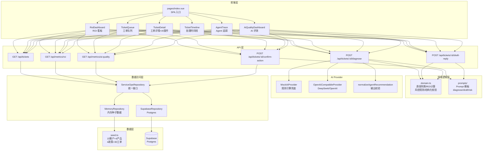

# TicketPilot 项目架构文档

## 整体架构



## 前端模块

### 页面结构（pages/index.vue）

单页应用，侧边栏 4 个面板：

| 面板       | 组件                                                  | 功能                                           |
| ---------- | ----------------------------------------------------- | ---------------------------------------------- |
| ROI 看板   | `RoiDashboard` + `RoiTrendChart` + `PriorityPieChart` | 5 个 KPI 卡片 + 趋势图 + 饼图 + 高价值工单列表 |
| 坐席工作台 | `TicketQueue` + `TicketDetail` + `TicketTimeline`     | 工单筛选/搜索 + 工单详情 + AI 操作 + 时间线    |
| AI 评测    | `AiQualityDashboard`                                  | 置信度分布图 + 动作分布图 + 风险标记排行       |
| Agent 追踪 | `TicketQueue` + `AgentTrace`                          | 工单选择 + 检索过程/证据引用/风控约束          |

### 组件通信

- 父组件 `pages/index.vue` 通过 props 下发 `tickets`、`metrics`、`selectedId`
- 子组件通过 `$emit` 向上通知（如 `selectTicket`、`refresh`）
- AI 初诊/回复草稿/人工确认通过 `$fetch` 调用 API，完成后 `emit('refresh')` 刷新数据

## Nitro API 层

6 个 API 端点，文件即路由（`server/api/` 下结构即 URL）：

```
GET  /api/tickets                    # 工单列表（含关联的 customer/product/recommendation/draft）
GET  /api/metrics/roi                # ROI 指标
GET  /api/metrics/ai-quality         # AI 质量指标
POST /api/tickets/:id/diagnose       # AI 初诊
POST /api/tickets/:id/draft-reply    # 生成回复草稿
POST /api/tickets/:id/confirm-action # 人工确认动作
```

详见 [API.md](./API.md)。

## Repository 数据访问层

```
ServiceOpsRepository (接口)
  ├── MemoryRepository    ← 默认，包装 seed.ts，内存读写
  └── SupabaseRepository  ← 可选，通过 REST API 读写 Postgres
```

### 切换方式

```bash
# Memory（默认，零配置）
DATA_PROVIDER=memory

# Supabase
DATA_PROVIDER=supabase
SUPABASE_URL=https://xxx.supabase.co
SUPABASE_SERVICE_ROLE_KEY=xxx
```

### 安全降级

`createRepository()` 工厂函数逻辑：

1. `DATA_PROVIDER=memory` → 始终使用 MemoryRepository
2. `DATA_PROVIDER=supabase` 且 `SUPABASE_URL` 和 `SUPABASE_SERVICE_ROLE_KEY` 都存在 → SupabaseRepository
3. `DATA_PROVIDER=supabase` 但缺环境变量 → **自动降级 MemoryRepository** + `console.warn`

## AI Provider 层

```
AiProvider (接口)
  ├── MockAiProvider              ← 规则引擎，确定性输出
  └── OpenAiCompatibleProvider    ← 调用 DeepSeek/OpenAI API
       ├── Prompt 模板拼装
       ├── 30s AbortController 超时
       ├── response_format: json_object
       ├── JSON 解析 + normalizeAgentRecommendation 校验
       └── 异常 → fallback Mock
```

### 切换方式

```bash
# Mock（默认）
NUXT_PUBLIC_AI_PROVIDER=mock

# DeepSeek
NUXT_PUBLIC_AI_PROVIDER=openai
OPENAI_BASE_URL=https://api.deepseek.com/v1
OPENAI_API_KEY=sk-xxx
OPENAI_MODEL=deepseek-chat
```

### 降级策略

- 无 API Key → Mock 输出，页面显示「Mock 生成」+「⚠ Fallback」
- API 返回非 200 → Mock 输出，validationWarnings 中包含错误信息
- 模型返回空内容 / 非 JSON → Mock 输出
- 请求超时（30s）→ Mock 输出
- 任何异常 → Mock 输出

## Prompt 模板

3 套 Prompt，位于 `server/prompts/`：

| 模板     | 文件                        | 用途                                                                             |
| -------- | --------------------------- | -------------------------------------------------------------------------------- |
| 工单初诊 | `diagnose-ticket.prompt.ts` | System Prompt 定义 JSON 字段约束 + 业务规则，User Prompt 传入工单/产品/政策/证据 |
| 回复草稿 | `draft-reply.prompt.ts`     | 基于诊断结论生成客户回复，要求语气专业有温度                                     |
| 风险复核 | `risk-review.prompt.ts`     | 复核 AI 诊断的风险点，确认高风险动作是否正确标记                                 |

### Prompt 设计原则

- System Prompt 明确 JSON Schema 约束
- 用 `response_format: { type: "json_object" }` 强制 JSON 输出
- 业务规则写进 Prompt（如"出现 水/漏液/撬锁 等词 → warrantyStatus 为 void_risk"）
- 高风险动作明确要求 `humanConfirmationRequired: true`

## RAG / 知识库检索

当前采用**关键词评分检索**（非向量数据库）：

### 检索流程

```
工单 issue + tags + category + product.line
  → 提取关键词（去重、过滤短词）
  → 逐篇文档匹配：
     标题命中 → +3 分
     内容命中 → +1 分
     分类匹配 → +2 分
  → 按分数排序 → 取 Top 3
  → 返回 Evidence[]（含 matchedTerms、score、category、updatedAt）
```

### 为什么不是向量数据库？

1. **可审计性**：关键词匹配的结果可以直观解释「为什么选中这篇文档」
2. **体量适配**：当前 6 篇知识库文档，向量检索无显著优势
3. **零依赖**：不需要额外的 embedding 模型或向量数据库服务
4. **可升级**：架构已为未来接入向量数据库留好接口（`RetrievalTrace.method` 字段）

### 升级路径

- 引入 `@supabase/vecs` 或 pgvector
- 在 Supabase 中建立 `knowledge_docs_embeddings` 表
- 检索方法从 `keyword` 切换为 `hybrid`（关键词 + 向量混合）

## 人工确认风控边界

AI **绝不**自动执行以下动作，只能生成建议和草稿：

| 高风险动作                | AI 行为               | 人工必须         |
| ------------------------- | --------------------- | ---------------- |
| 派工（dispatch）          | 建议派工 + 预填派工单 | 确认工程师和时间 |
| 换新（replacement）       | 预填换新审批          | 确认库存和物流   |
| 退款复核（refund_review） | 预填退款单            | 确认金额和原因   |
| 升级主管（escalate）      | 建议升级              | 确认升级对象     |
| 关闭工单（close）         | 建议关闭              | 确认问题已解决   |

### 技术保障

- `normalizeAgentRecommendation()` 强制校验：`humanConfirmationRequired` 在 `nextBestAction` 为高风险时必须为 `true`
- 前端「人工确认」按钮必须点击才能执行
- 确认后时间线自动追加记录，审计可追溯

## 可扩展方向

### 短期（1-2 周）

- [ ] 用户认证（Supabase Auth）
- [ ] 多角色权限（坐席/主管/管理员）
- [ ] 工单满意度回访

### 中期（1-2 月）

- [ ] 向量数据库 RAG（pgvector）
- [ ] WebSocket 实时工单推送
- [ ] 多语言支持
- [ ] E2E 测试（Playwright）

### 长期

- [ ] 工单自动路由和负载均衡
- [ ] 坐席绩效看板
- [ ] 移动端适配
- [ ] 第三方售后系统对接（ERP/CRM）
